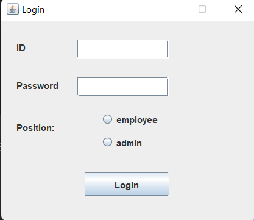
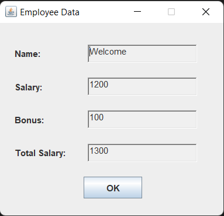
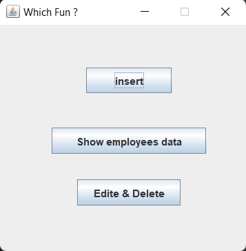
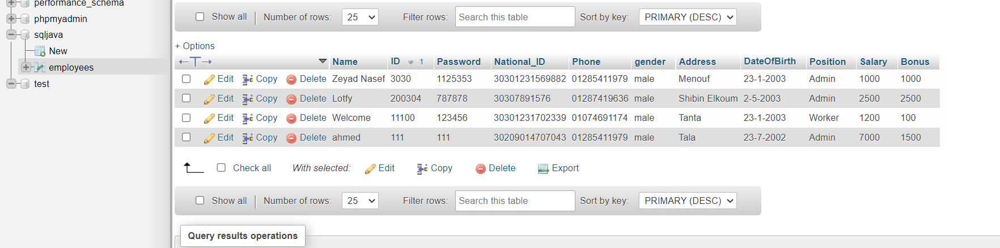
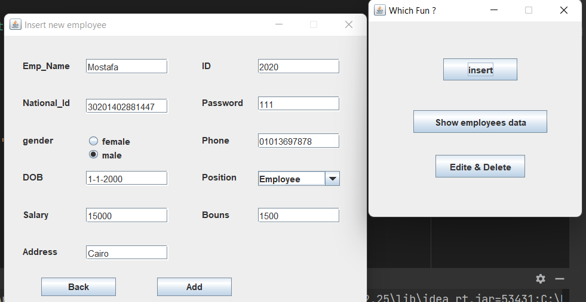
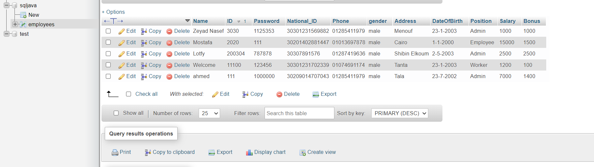
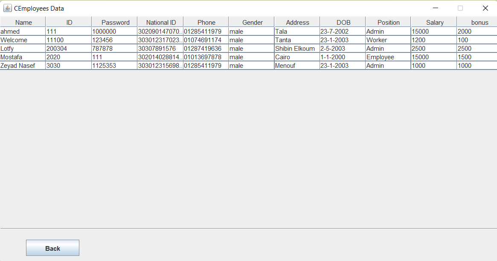
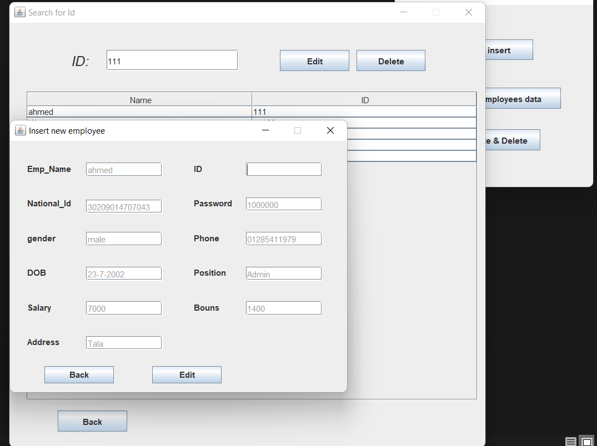
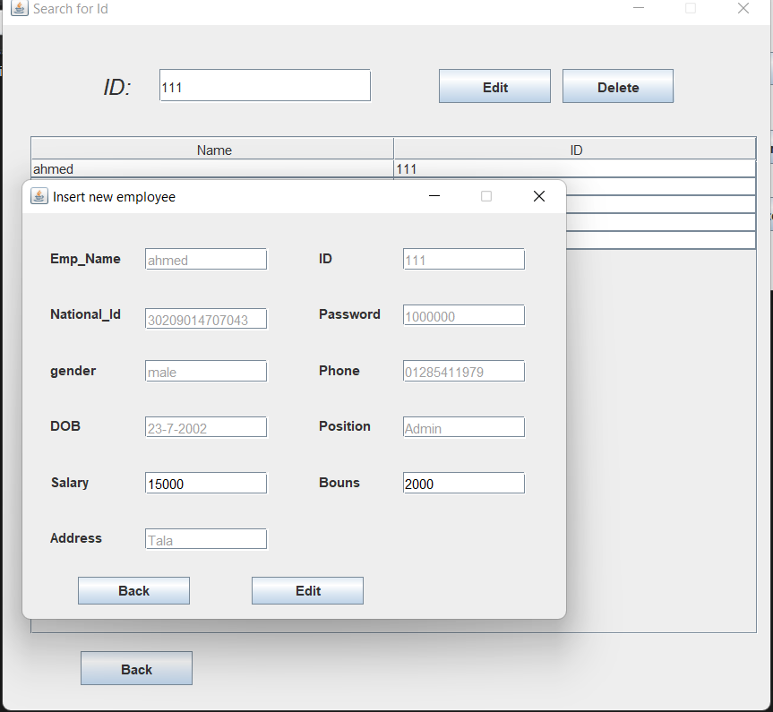
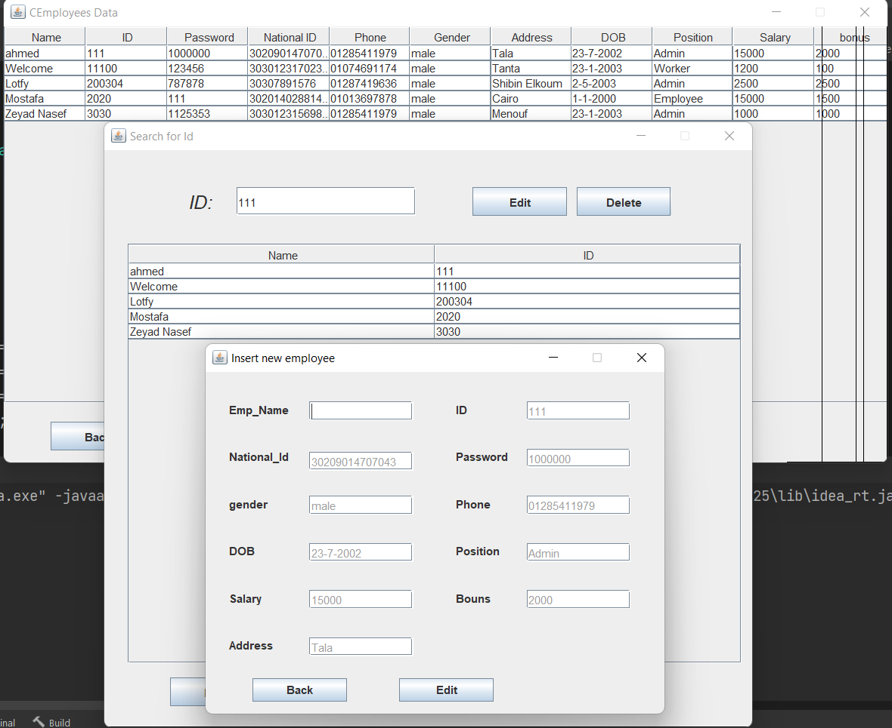

# Java gui Employee System

  * ### We were team of 5 people and worked together on this project to enhance the functionality of the Employee System.
  * ### **I took the part of show the data exist in our DB in the text field when edit data, and implement many classes to get data and see when focus gained and focus lost, then use them in our textfield**
  * ### **<u>All Classes exist in src file</u>**
  * ### It's big java project work with GUI and database to store and organize data of employees in your database with <u>jdbc drive </u>.
  * ### You can use simple interface without need to learn how to deal with database as it shows in the pictures.
  >This is the first look of the interface after you run the program.
  
  ***
  * **after that you can login as admin to see the project main functions and edit the data in the database **OR** login as employee to see the your personal information like **<u>(Name, Salary, Bonus, Total Salary)</u>** as it shown:**
  
  >This show the employee's personal information.
  
***
  * **if you login as admin you can use system functions and edit system data or even insert and delete data in the database as it shown :**
  >This is the admin's interface.
    

***
* **when you want to insert new employee you can enter his data and just press add as it shown:**
> * this is first database look:
>
>  * Then you can insert data from here and fill all fields then press add to show added successfully: 
> 
>  * you will see that DB has been updated here:
  
***
* **You can show DB elements by press Show Employees Data :**
> 
***
* **The last 2 functions is to delete or edit employee's data from your DB:**
> * this is data before editing:
>
>  * Then you can edit all fields you want except name and id because they work as a primary keys: 
> 
>  * you will see that DB has been updated here:
> 
> * you also can enter the id and choose delete then ensure the process and it will disappear from your DB.
***
## 🚀&nbsp; Installation

1. Download the project from Github by applying ```git clone``` command to this  [link](https://github.com/Zeyad2003/GUI-Employee-System.git).

2. Install Java language to your machine. 

3. Add the project to your workspace.

4. Add JDBC driver .jar file to your project.

5. Run MySQL on your machine and create the data you want as the above pictures.

6. Run ```FinalProject``` Class.
<hr>

# It was great experience and nice Team Work and excited about the next11
